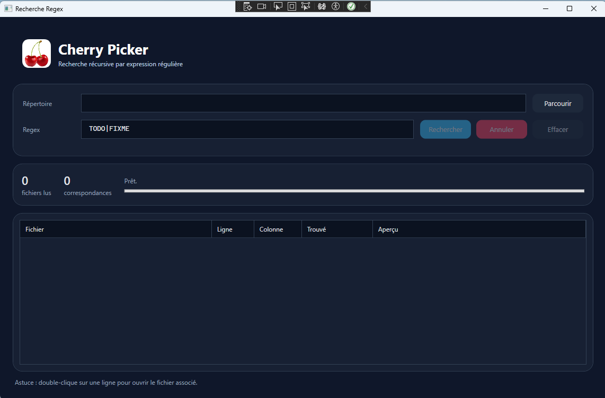
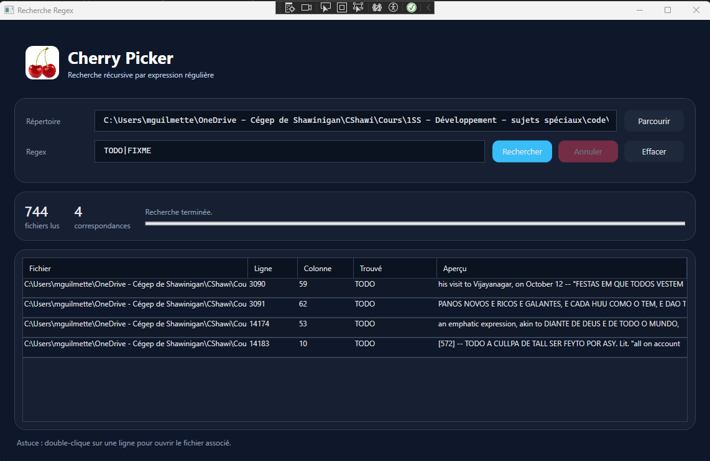

<p align="Center"></p>

<h4 align="Center">1SS - Sujets spéciaux</h4>

# 🏋🏻‍♂️ Projet 2 - CherryPicker (v.0.8) - 25%

Infologique Innovations est une entreprise oeuvrant dans la recherche et le développement a présentement un soucis avec sa gestion documentaire.  Elle possède [plusieurs milliers de fichier de rapports importants](./includes/Archives.zip) et extraire des données est devenu une tâche bien ardue et coûteuse.

Elle vous a donc mandaté afin de développer un logiciel utilitaire permettant de faire des recherches personnalités dans l'ensemble des fichiers enfants d'un répertoire de base.  Votre utilitaire fera sauver beaucoup d'argent à l'entreprise

Cédrik Dubogue, employé d'Infologique Innovations à [débuté le projet](<./includes/CherryPicker%20(Base%20Project).zip>) en créant l'interface utilisateur et vous demande de compléter l'utilitaire en y ajoutant la logique métier.

Voici le cahier des charges soumis par Infologique Innovations.

# Cahier des charges — Projet logiciel

**Nom du logiciel :** CherryPicker  
**Type de projet :** Utilitaire de recherche spécialisée

## 1. Présentation du projet

**Description :**  
CherryPicker est un utilitaire permettant de rechercher du texte à l'intérieur des fichiers d'un répertoire et de ses sous-répertoires permettant les filtres en expressions régulières.

**Problématique :**  
La recherche manuelle d'informations dans un grand nombre de fichiers est longue et fastidieuse et coûte très cher à l'entreprise.

**Objectif :**  
Développer un outil simple et rapide permettant d'automatiser cette recherche.

## 2. Exigences fonctionnelles

| ID | Fonctionnalité | Priorité |
|---|---|---|
| F01 | Sélectionner un répertoire de base | Obligatoire |
| F02 | Parcourir le répertoire et ses sous-répertoires | Obligatoire |
| F03 | Rechercher une expression régulière dans les fichiers texte | Obligatoire |
| F04 | Afficher les fichiers correspondants | Obligatoire |
| F05 | Être en mesure d'annuler l'opération | Obligatoire |
| F06 | Afficher l'emplacement (#ligne et #colonne) du résultat dans le fichier | Souhaitable |
| F07 | Afficher l'aperçu résultat dans le fichier | Souhaitable |
| F08 | Afficher une progression réelle | Souhaitable |

## 4. Exigences non fonctionnelles

- **Performance :** l'interface doit demeurer réactive pendant une recherche.
- **Robustesse :** les fichiers inaccessibles ne doivent pas provoquer l'arrêt de l'application.
- **Fiabilité :** une recherche doit retourner tous les fichiers accessibles correspondant aux critères.

## 5. Interface utilisateur
### Ouverture de l'application

### Après le résultat de recherche


## 6. Limites et exclusions

- Aucune recherche dans des fichiers PDF ou Word.
- Aucune modification des fichiers analysés.
- Aucune recherche sur des ordinateurs distants.
- Aucun système d'authentification.

## 7. Livrables
- Code source complet.

## 8. Critères d'acceptation

- La recherche fonctionne sur une arborescence d'au moins 10 niveaux.
- Une recherche sans résultat affiche un message approprié.
- Les résultats indiquent le chemin complet des fichiers.
- Un fichier inaccessible ne fait pas planter l'application.
- L'interface demeure utilisable pendant la recherche.
- En tout temps il doit être possible d'annuler une recherche.

---

## Annexe — Considérations techniques ?

| Cahier des charges | Considérations technique |
|---|---|
| Le logiciel doit parcourir tous les sous-répertoires. | Utiliser une fonction récursive. |
| L'interface doit demeurer réactive. | Utiliser `async/await`. |
| Les résultats doivent apparaître dans une liste. | Utiliser un `DataGrid` WPF. |
| Le logiciel doit gérer les erreurs d'accès. | Utiliser `try/catch`. |


# Suggestion de structure de travail
## FileSearchService
1. Faire un `singleton` de cette classe.
2. Programmer, en étapes, une fonction de recherche dans un fichier précis :
    1. Débutez par le noeud de la fonction, la recherche d'expression régulière :
    ```csharp
        public void SearchFile(string filePath, Regex regex) {
            // Lire le fichier dans une variable
            // Appliquer le Regex à cette variable
            // Afficher les résultats à la console pour commencer
        }
    ```
    - Testez avec [ce fichier](./includes/test.txt) au besoin.
    2. Passer les résultats de recherche dans un rapport `SearchResultItem` à l'aide d'un `Progress`. 
    ```csharp
    public void SearchFile(string filePath, Regex regex, IProgress<SearchResultItem> results) {
        // Déclencher la fonction `Report` du progress `results` pour chaque résultat.
    }
    ```
## SearchResultItem
Classe `Models` servant simplement à enregistrer un résultat unique de recherche avec, au minimum, les attributs `filePath` (fichier source) et `match` (ce qui a été trouvé).
<!-- # Critères de correction
| #	| Critère	| Points |
| --- | --------------- | ----- |
| 1 | Justesse du langage utilisé (français & anglais)  |  3 |
| 2 | Fonctionnement de la traduction textuelle UI  |  5 |
| 3 | Fonctionnement de la traduction textuelle provenant du code  |  5 |
| 4 | Changement de logo selon la langue  |  2 |
| 5 | Implication de l'étudiant dans le Git du projet  |  - | -->
<hr><p align="Center"></p> ```
